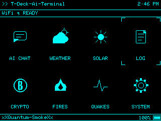
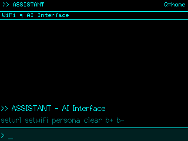
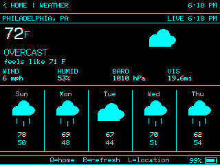
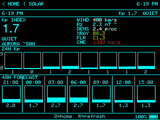
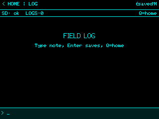
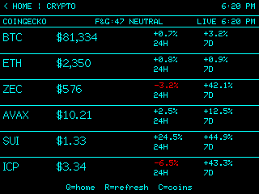
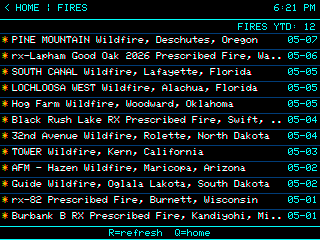
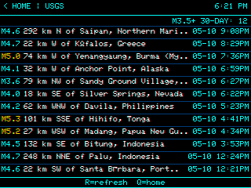
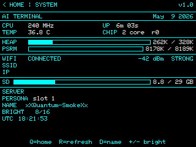

# MayDay T-Deck AI Terminal

A field-ready firmware build for the LILYGO T-Deck ESP32-S3. Started as an AI chat terminal and evolved into a full suite covering AI persona chat, weather, solar conditions, crypto, field logging, wildfire and USGS earthquake feeds, and system diagnostics.

Built by Commander Smoke, with development assistance from Codex.

[](https://www.patreon.com/c/xXQuantumSmokeXx)



## Display Gallery

| AI Chat | Weather | Solar |
| --- | --- | --- |
|  |  |  |

| Log | Crypto | Fires |
| --- | --- | --- |
|  |  |  |

| USGS | System |
| --- | --- |
|  |  |

## Features

- **AI CHAT** — SD-loaded personas, named assistants, HTTP backend with full conversation context
- **WEATHER** — Open-Meteo forecast with user-configured latitude and longitude, 5-day strip, stats row
- **SOLAR** — NOAA/SWPC space weather: Kp history, 48h forecast, Bz, solar wind speed, flares, and CME data
- **LOG** — Field notes written to SD card with add, select, edit, and delete support
- **CRYPTO** — Up to six CoinGecko favorites, 24h/7d movement, 7-day sparklines, and Fear & Greed index
- **FIRES** — NASA EONET open wildfire events, live feed
- **USGS** — Recent M3.5+ earthquake feed from USGS FDSNWS
- **SYSTEM** — Device, WiFi, SD, heap, uptime, backend, persona status, and brightness control
- Cyan terminal aesthetic tuned for the T-Deck 320×240 display

## Hardware Required

- LILYGO T-Deck, ESP32-S3 version
- microSD card for WiFi bootstrap, personas, cache, and field logs
- WiFi network for AI backend, weather, solar, crypto, fire/quake feeds, and NTP sync

## Flashing

**Option 1 — M5Launcher (SD card, no USB required):**

1. Grab `AiTerminal.bin` from the [latest release](https://github.com/xXQuantumSmokeXx/T-Deck-Ai-Terminal/releases/latest) and copy it to your SD card root.
2. Boot into M5Launcher on the T-Deck.
3. Select `AiTerminal.bin` and flash.

**Option 2 — Build and flash from source:**

1. Install PlatformIO and clone this repo.
2. Flash directly over USB:

```sh
pio run --target upload
```

Or build the binary and copy it to SD for M5Launcher:

```sh
pio run
copy .pio\build\T-Deck\firmware.bin F:\AiTerminal.bin
```

## SD Card Setup

The firmware reads plain text files from the SD card root on boot. All setup files are optional after initial configuration — credentials and settings are persisted to NVS.

### `wifi.txt`

```txt
YourWiFiSSID
YourWiFiPassword
```

Read on boot, saved to NVS. Delete after confirmed working.

### `portal.txt`

```txt
https://your-server-url.ngrok-free.app
```

Sets the AI backend base URL. Chat requests go to `{portal_url}/simple`. Delete after confirmed working if desired.

**Expected request body:**

```json
{
  "message": "hello",
  "system": "persona system prompt",
  "context": [
    { "role": "user", "content": "previous message" },
    { "role": "assistant", "content": "previous reply" }
  ]
}
```

**Expected response body:**

```json
{ "response": "assistant reply text" }
```

You can also change the backend URL from within AI CHAT by typing `seturl`.

### `donki.txt` — Optional

SOLAR uses NASA's public `DEMO_KEY` by default. For higher rate limits, get a free key at [api.nasa.gov](https://api.nasa.gov) and place it on the first line:

```txt
YOUR_NASA_DONKI_API_KEY
```

Saved to NVS on boot. Delete after confirmed working.

### Personas

Persona files live in `/personas/` on the SD card:

```txt
/personas/p1.txt
/personas/p2.txt
/personas/p3.txt
```

**File format:**

```txt
NAME
Title or short role
System prompt text goes here.
It can span multiple lines.
```

Slot 1 has a built-in fallback if `/personas/p1.txt` is missing. Slots 2 and 3 load only when their files are present. Type `persona` in AI CHAT to cycle slots. Type `setassist1` or `setassist2` to configure the display name shown in the chat header for each slot.

### Field Logs

The LOG screen writes entries to `/logs/field.log`. The firmware creates this file automatically. Keep the SD card inserted for LOG to work.

### Crypto Favorites

Load up to six CoinGecko coin IDs from `/crypto.txt` (one per line):

```txt
bitcoin
ethereum
solana
chainlink
dogecoin
litecoin
```

Use CoinGecko slugs, not ticker symbols. Falls back to `/coins.txt`, then to any on-device saved coins, then to the default BTC/ETH pair.

## Controls

### Launcher

| Input | Action |
| --- | --- |
| Trackball up/down/left/right | Move between tiles |
| Trackball click (press ball) | Open selected tile |
| Enter | Open selected tile |
| W/A/S/D or I/J/K/L | Keyboard tile navigation |

### Module Screens

- **Trackball roll right** or **Q / Escape / Backspace**: return home
- **R**: refresh on data screens that support it

### AI CHAT

| Command | Action |
| --- | --- |
| Type + Enter | Send message |
| Trackball up/down | Scroll chat history |
| `seturl` | Change AI backend URL |
| `setwifi` | Change WiFi credentials |
| `setassist1` / `setassist2` | Set chat display name for persona slot 1 or 2 |
| `persona` | Cycle loaded persona slot |
| `clear` | Clear chat history and context |

### WEATHER

- **R**: refresh — **L**: set latitude/longitude — **Q**: home
- Coordinates saved to NVS as `wx_lat` / `wx_lon`

### CRYPTO

- **R**: refresh — **C**: open on-device coin ID editor (up to six slots) — **Q**: home

### SYSTEM

- **R**: refresh diagnostics — **+** / **-**: adjust brightness (saved to NVS) — **Q**: home

## Data Sources

| Screen | Source |
| --- | --- |
| WEATHER | Open-Meteo forecast API |
| SOLAR | NOAA/SWPC + NASA DONKI (flares, CME) |
| CRYPTO | CoinGecko markets + Alternative.me Fear & Greed |
| FIRES | NASA EONET open wildfire events |
| USGS | USGS FDSNWS earthquake feed |
| LOG | Local SD card `/logs/field.log` |
| SYSTEM | Local ESP32-S3 state |

Data screens cache their last successful fetch so they remain useful between refreshes and across brief offline periods.

## Project Layout

```txt
src/main.cpp              Boot flow, screen router, trackball and keyboard handling
src/ui/                   Theme constants, home launcher, shared widgets
src/modules/chat.*        AI chat client, persona context, command handling
src/modules/weather.*     Weather dashboard and location configuration
src/modules/solar.*       Solar / space-weather dashboard
src/modules/btc.*         Crypto dashboard and CoinGecko favorites
src/modules/noaa.*        Field LOG module
src/modules/world.*       FIRES and USGS earthquake feeds
src/modules/sysinfo.*     System diagnostics and brightness control
src/net/wifi_mgr.*        WiFi credential handling and NVS storage
src/persona/              SD persona loader and slot manager
sd_card/                  Example SD card layout and setup files
```

## v1.1.1 Changes

- Trackball click (press ball down) now launches the selected home tile
- Assistant display names in chat driven by `setassist1` / `setassist2` instead of defaulting to persona name
- Fixed screen bleedthrough on CRYPTO and WEATHER after SD card SPI operations
- Fixed FIRES showing No Data on first load due to stream-parse timing
- Restored bottom hint bar borders on CRYPTO screen

## Security Notes

All SD setup files persist until you delete them. Remove them manually after confirming each works.

- **`wifi.txt`** — contains WiFi credentials
- **`portal.txt`** — contains your backend URL
- **`donki.txt`** — contains your NASA API key
- **Persona files** — may contain private system prompts

Treat the SD card as sensitive. If it is lost or accessed, any remaining setup files are readable in plain text.
